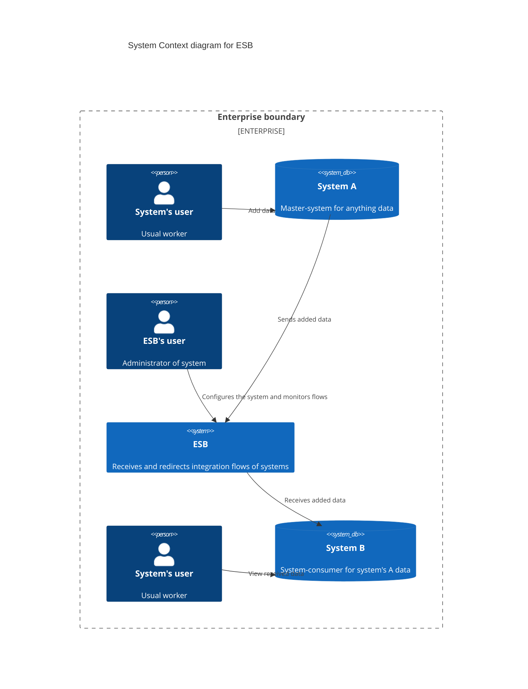

# Project's C4 diagram

## L1. System Landscape

```mermaid
C4Context
    title System Context diagram for ESB
    Enterprise_Boundary(eb0, "Enterprise boundary") {
        Person(userA, "System's user", "Usual worker")
        SystemDb(SystemA, "System A", "Master-system for anything data")

        Person(userESB, "ESB's user", "Administrator of system")
        System(SystemESB, "ESB", "Receives and redirects integration flows of systems")

        Person(userB, "System's user", "Usual worker")
        SystemDb(SystemB, "System B", "System-consumer for system's A data")
        
        Rel_R(userA, SystemA, "Add data")
        Rel_R(SystemA, SystemESB, "Sends added data")
        Rel_D(userESB, SystemESB, "Configures the system and monitors flows")
        
        Rel(SystemESB, SystemB, "Receives added data")
        Rel(userB, SystemB, "View received data")
        
    }
```

## L2. Container

## L3. Component

## L4. Code

### Entity Relationship

```mermaid
erDiagram

    complex_type {
        numeric a
        text b 
        boolean c
        timestamp d
    }

    global {
        varchar(100) name PK
        complex_type value "Not Null. Value's type is complex type"
    }

    global }|--|| complex_type : "value's type"

    versions {
        uuid id PK, FK
        int version PK
        timestamp create_time "Not null. Default - now(), 'utc'"
        timestamp update_time "Not null.  Default - now(), 'utc'"
        text object "Not null. Default - ''"
    }

    external_systems {
        uuid id PK "Generated"
        varchar(100) name UK
        varchar(50) ip
        varchar(50) port
        varchar(300) path
        text driver
        int version "Not null. Default - 0"
    }

    external_users {
        uuid id PK "Generated"
        varchar(100) name UK
        uuid system FK "Not null"
        uuid type FK "Not null"
        varchar(50) username
        varchar(50) password
        varchar(100) token
        int version "Not null. Default - 0"
    }

    authentication_types {
        uuid id PK "Generated"
        varchar(100) name UK "Basic, BearerToken"
        varchar(300) description
    }

    external_users }|--|{ external_systems : "system"
    external_users }|--|| authentication_types : "type"

    threads_groups {
        uuid id PK "Generated"
        varchar(100) name UK
        uuid protocol FK "Not null"
        uuid parent FK "Hierarchy"
        int version "Not null. Default - 0"
    }

    threads_groups }|--|| authentication_types : "protocol"

    threads {
        uuid id PK "Generated"
        varchar(100) name UK
        uuid group FK "Not null"
        uuid message_converte_type FK
        int version "Not null. Default - 0"
    }

    message_converte_types {
        uuid id PK "Generated"
        varchar(100) name UK "Multiplex, Split, None"
        varchar(300) description
    }

    threads }|--|{ threads_groups : "group"
    threads }|--|| message_converte_types : "message_converte_type"

    routes {
        uuid id PK "Generated"
        varchar(100) name UK
        text path "Not null"
        uuid system FK "Not null"
        uuid method FK
        int version "Not null. Default - 0"
    }

    rest_methods {
        uuid id PK "Generated"
        varchar(100) name UK "Get, Post, Patch, Put, Delete"
        varchar(300) description
    }

    routes }|--|{ external_systems : "system"
    routes }|--|| rest_methods : "method"

    thread_objects {
        uuid id PK "Generated"
        varchar(100) name UK
        varchar(100) name_object
        uuid type FK
        uuid parent FK "Hierarchy"
        int version "Not null. Default - 0"
    }

    value_types {
        uuid id PK "Generated"
        varchar(100) name UK "String, Date, Integer, Boolean, Null, Structure, Array"
        varchar(300) description
    }

    thread_objects }|--|| value_types : "type"

    routines {
        uuid id PK "Generated"
        varchar(100) name UK
        uuid type "Not null"
        text code "Not null"
        int version "Not null. Default - 0"
    }

    routine_types {
        uuid id PK "Generated"
        varchar(100) name UK "Before, After"
        varchar(300) description
    }

    routines }|--|| routine_types : "type"

    threads_routes {
        uuid thread PK, FK
        uuid route PK, FK
        uuid direction PK, FK
        uuid file_format FK "Not null"
        uuid object FK "Not null"
        uuid routine FK 
    }

    directions {
        uuid id PK "Generated"
        varchar(100) name UK "In, Out"
        varchar(300) description
    }

    file_formats {
        uuid id PK "Generated"
        varchar(100) name UK "XML, JSON, DBF, CSV, TXT"
        varchar(300) description
    }

    threads_routes }|--|{ threads : "thread"
    threads_routes }|--|{ routes : "route"
    threads_routes }|--|| directions : "direction"
    threads_routes }|--|| file_formats : "file_format"
    threads_routes }|--|{ thread_objects : "object"
    threads_routes }|--|{ routines : "routine"

```